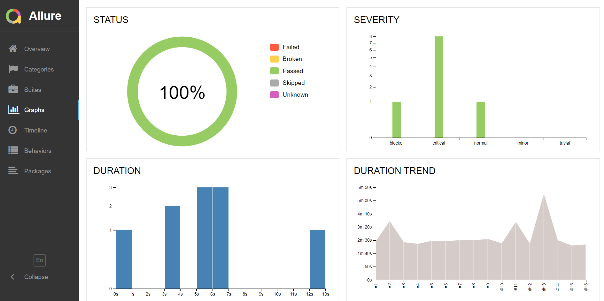

# UI-автотесты для сайта Клуба приключений - [vpoxod_ru](https://www.vpoxod.ru/)
Учебный проект: UI-тесты для сайта vpoxod.ru

<!-- Технологии -->
## Использованы технологии:
<p  align="left">
  <code></code>
  <code></code>
  <code></code>
  <code></code>
  <code></code>
  <code></code>
  <code></code>
  <code></code>
  <code></code>
  <code></code>
  <code></code>
  <code></code>
</p>

<!-- Тест кейсы -->

## Автоматизировано тестирование функционала:
* Поле поиска в хедере (позитивный и негативный сценарий)
* Форма поиска на главной - быстрый подбор путешествия по параметрам
* Подбор путешествия по параметрам (по цене)
* Проверка главного меню сайта
* Проверка файла логотипа

## Запуск тестов в Jenkins
<p  align="left">
  <code></code>
</p>

### [Jenkins](https://jenkins.autotests.cloud/job/005_tsgibneva_vpoxodru_ui_tests/)

#### Запуск тестов:
```bash
python -m venv .venv
source .venv/bin/activate
pip install -r requirements.txt
pytest .
```
  
##### При нажатии на "Собрать сейчас" тесты собираются из GitHub и начинается прохождение тестов в Selenide.
<p  align="left">
  <code></code>
</p>

## В результате генерируется allure-отчет
<p  align="left">
  <code></code>
</p>

### [Allure-report](https://jenkins.autotests.cloud/job/005_tsgibneva_vpoxodru_ui_tests/16/allure/)

##### Сводная инфомация по прогону тестов
<p  align="left">
  <code></code>
</p>

##### Инофграфика
<p  align="left">
  <code></code>
  <code></code>
</p>

##### Во вкладке Behavoirs тесты сгруппированы с точки зрения бизнес-логики, есть описание шагов, скриншот последнего шага теста, браузерные логи, видео прохождения кейса
<p  align="left">
  <code></code>
  <code></code>
</p>

## Тут надо написать про аллюр-тестопс и джиру
<p  align="left">
  <code></code>
  <code></code>
</p>

## По результату прогона отправляется уведомление в телеграм
<p  align="left">
  <code></code>
</p>

<p  align="left">
  <code></code>
</p>


## Пример прогона теста с автоматизацией отправки формы поиска на главной
<p  align="left">
  <code></code>
</p>

<p align="center">
  
</p>
